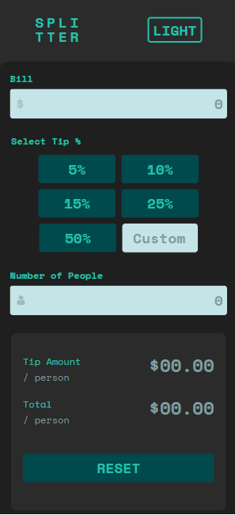

# Frontend Mentor - Tip calculator app solution

Esta é uma solução para o [desafio do aplicativo de calculadora de dicas no Frontend Mentor](https://www.frontendmentor.io/challenges/tip-calculator-app-ugJNGbJUX). Os desafios do Frontend Mentor ajudam você a melhorar suas habilidades de codificação criando projetos realistas.

### The challenge

Os usuários devem ser capazes de:

- Visualizar o layout ideal para o aplicativo, dependendo do tamanho da tela do dispositivo
- Ver os estados de foco para todos os elementos interativos na página
- Calcular a gorjeta correta e o custo total da conta por pessoa

### Screenshot

- Desktop Light Mode

- Desktop Dark Mode

- Mobile Light Mode

- Mobile Dark Mode

### Built with

- HTML5
- CSS3
- JavaScript
- Mobile-first workflow

### What I learned

Desenvolvi este projeto utilizando o conceito de Mobile First, gostei bastante do resultado ainda
mais por ser o meu primeiro projeto com a opção de Dark Mode. 

## Author

- Website - [Rodrigo Souza](https://rodrigobsouza.github.io/eu-rodrigo/)
- Frontend Mentor - [@RodrigoBSouza](https://www.frontendmentor.io/profile/RodrigoBSouza)
- LinkedIn - [@rodrigo-b-souza](https://www.linkedin.com/in/rodrigo-b-souza/)
